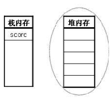
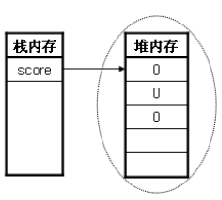
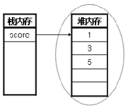

[TOC]
# Java基础

## Java 的两大数据类型

1. 内置数据类型

    八种基本类型(六种数据类型，一种字符型，一种布尔型)

   byte, short, int, long, float, double, boolean, char

2. 引用数据类型

   引用类型指向一个对象，指向对象的变量是引用变量。这些变量在声明时被指定为一个特定的类型，比如 Employee、Puppy 等。变量一旦声明后，类型就不能被改变了。

## 类型转换

1. 自动类型转换从低级到高级。

   整型、实型（常量）、字符型数据可以混合运算。运算中，不同类型的数据先转化为同一类型，然后进行运算。

```
低  ------------------------------------>  高

byte,short,char—> int —> long—> float —> double 
```

2. 强制类型转换

   转换的数据类型必须是兼容的。

3. 隐含强制类型转换

   整数的默认类型是int。

## 变量类型

1. 局部变量

   - 局部变量声明在方法、构造方法或者语句块中；
   - 局部变量在方法、构造方法、或者语句块被执行的时候创建，当它们执行完成后，变量将会被销毁；

   - 访问修饰符不能用于局部变量；

   - 局部变量只在声明它的方法、构造方法或者语句块中可见；

   - 局部变量是在栈上分配的。

   - 局部变量没有默认值，所以局部变量被声明后，必须经过初始化，才可以使用。

2. 实例变量

   - 实例变量声明在一个类中，但在方法、构造方法和语句块之外；
   - 当一个对象被实例化之后，每个实例变量的值就跟着确定；
   - 实例变量在对象创建的时候创建，在对象被销毁的时候销毁；
   - 实例变量的值应该至少被一个方法、构造方法或者语句块引用，使得外部能够通过这些方式获取实例变量信息；
   - 实例变量可以声明在使用前或者使用后；
   - 访问修饰符可以修饰实例变量；
   - 实例变量对于类中的方法、构造方法或者语句块是可见的。一般情况下应该把实例变量设为私有。通过使用访问修饰符可以使实例变量对子类可见；
   - 实例变量具有默认值。数值型变量的默认值是0，布尔型变量的默认值是false，引用类型变量的默认值是null。变量的值可以在声明时指定，也可以在构造方法中指定；
   - 实例变量可以直接通过变量名访问。但在静态方法以及其他类中，就应该使用完全限定名：ObejectReference.VariableName。

3. 类变量(静态变量)

   - 类变量也称为静态变量，在类中以 static 关键字声明，但必须在方法之外。

   - 无论一个类创建了多少个对象，类只拥有类变量的一份拷贝。

   - 静态变量除了被声明为常量外很少使用。常量是指声明为public/private，final和static类型的变量。常量初始化后不可改变。

   - 静态变量储存在静态存储区。经常被声明为常量，很少单独使用static声明变量。

   - 静态变量在第一次被访问时创建，在程序结束时销毁。

   - 与实例变量具有相似的可见性。但为了对类的使用者可见，大多数静态变量声明为public类型。

   - 默认值和实例变量相似。数值型变量默认值是0，布尔型默认值是false，引用类型默认值是null。变量的值可以在声明的时候指定，也可以在构造方法中指定。此外，静态变量还可以在静态语句块中初始化。

   - 静态变量可以通过：*ClassName.VariableName*的方式访问。

   - 类变量被声明为public static final类型时，类变量名称一般建议使用大写字母。如果静态变量不是public和final类型，其命名方式与实例变量以及局部变量的命名方式一致。

## 修饰符

### 访问控制修饰符

- **default** (即默认，什么也不写）: 在同一包内可见，不使用任何修饰符。使用对象：类、接口、变量、方法。不同包子类不可见

- **private** : 在同一类内可见。使用对象：变量、方法。并且类和接口不能声明为 **private**。 **注意：不能修饰类（外部类）**

- **public** : 对所有类可见。使用对象：类、接口、变量、方法。接口里的变量都隐式声明为 **public static final**,而接口里的方法默认情况下访问权限为 **public**。

- **protected** : 对同一包内的类和所有子类可见。使用对象：变量、方法。 **注意：不能修饰类（外部类）**。非子包中只可通过继承重写方法，无法调用父类实例方法。

  |  修饰符   | 当前类 | 同一包 | 子孙类（同一包） | 子孙类（不同包） | 其他包 |
  | :-------: | :----: | :----: | :--------------: | :--------------: | :----: |
  |  public   |   Y    |   Y    |        Y         |        Y         |   Y    |
  | protected |   Y    |   Y    |        Y         |       Y/N        |   N    |
  |  default  |   Y    |   Y    |        Y         |        N         |   N    |
  |  private  |   Y    |   N    |        N         |        N         |   N    |

#### 访问控制和继承

- 父类中声明为 public 的方法在子类中也必须为 public。
- 父类中声明为 protected 的方法在子类中要么声明为 protected，要么声明为 public，不能声明为 private。
- 父类中声明为 private 的方法，不能够被继承。

### 非访问修饰符

- static 修饰符，用来修饰类方法和类变量。

- final 修饰符，用来修饰类、方法和变量，final 修饰的类不能够被继承，修饰的方法不能被继承类重新定义，修饰的变量为常量，是不可修改的。

- abstract 修饰符，用来创建抽象类和抽象方法。一个类不能同时被 abstract 和 final 修饰。

- synchronized 和 volatile 修饰符，主要用于线程的编程。synchronized 关键字声明的方法同一时间只能被一个线程访问。volatile 修饰的成员变量在每次被线程访问时，都强制从共享内存中重新读取该成员变量的值。而且，当成员变量发生变化时，会强制线程将变化值回写到共享内存。这样在任何时刻，两个不同的线程总是看到某个成员变量的同一个值。

- transient 修饰符，序列化的对象包含被 transient 修饰的实例变量时，java 虚拟机(JVM)跳过该特定的变量。

   该修饰符包含在定义变量的语句中，用来预处理类和变量的数据类型。

## Java运算符

#### 运算符分类

- 算数运算符
- 关系运算符
- 位运算符
- 逻辑运算符
- 赋值运算符
- 条件运算符 （三元运算符）
- instanceof运算符 ( Object reference variable ) instanceof  (class/interface type)

#### 运算符优先级

Java 语言中运算符的优先级共分为 14 级，其中 1 级最高，14 级最低。在同一个表达式中运算符优先级高的先执行。表 1 列出了所有的运算符的优先级以及结合性。

| 优先级 | 运算符                                           |  结合性  |
| :----: | ------------------------------------------------ | :------: |
|   1    | ()、[]、{}                                       | 从左向右 |
|   2    | !、+、-、~、++、--                               | 从右向左 |
|   3    | *、/、%                                          | 从左向右 |
|   4    | +、-                                             | 从左向右 |
|   5    | «、»、>>>                                        | 从左向右 |
|   6    | <、<=、>、>=、instanceof                         | 从左向右 |
|   7    | ==、!=                                           | 从左向右 |
|   8    | &                                                | 从左向右 |
|   9    | ^                                                | 从左向右 |
|   10   | \|                                               | 从左向右 |
|   11   | &&                                               | 从左向右 |
|   12   | \|\|                                             | 从左向右 |
|   13   | ?:                                               | 从右向左 |
|   14   | =、+=、-=、*=、/=、&=、\|=、^=、~=、«=、»=、>>>= | 从右向左 |

## Java switch case 语句

1. switch case 执行时，一定会先进行匹配，匹配成功返回当前 case 的值，再根据是否有 break，判断是否继续输出，或是跳出判断。

2. 如果 case 语句块中没有 break 语句时，JVM 并不会顺序输出每一个 case 对应的返回值，而是继续匹配，匹配不成功则返回默认 case。

3. 如果 case 语句块中没有 break 语句时，匹配成功后，从当前 case 开始，后续所有 case 的值都会输出。

4. 如果当前匹配成功的 case 语句块没有 break 语句，则从当前 case 开始，后续所有 case 的值都会输出，如果后续的 case 语句块有 break 语句则会跳出判断。

   ```java
   public class Test {
      public static void main(String args[]){
         int i = 1;
         switch(i){
            case 0:
               System.out.println("0");
            case 1:
               System.out.println("1");
            case 2:
               System.out.println("2");
            case 3:
               System.out.println("3"); break;
            default:
               System.out.println("default");
         }
      }
   }
   ```

   ```java
   1
   2
   3
   ```

## 数组

* 数组的定义

  Java 中定义数组的语法有两种：
    type arrayName[];
    type[] arrayName;

* 数组的初始化

  声明数组的同时进行初始化（静态初始化），也可以在声明以后进行初始化（动态初始化）

  ```java
  public class Test {
      public static void main(String[] args) {
          int score[] = null; // 【1】声明数组，但未开辟堆内存
          score = new int[3]; // 【2】为数组开辟堆内存空间，大小为3
          for (int x = 0; x < score.length; x++) { // 数组的长度可以用“数组名.length”
              score[x] = x * 2 + 1 ; // 为每一个元素赋值
          } // 【3】开辟堆内存空间结束
          for (int x = 0; x < 3; x++) { // 使用循环依次输出数组中的全部内容
              System.out.println("score[" + x + "] = " + score[x]);
          }
      }
  }
  ```
【1】【2】【3】处分别对应下面这三张图：

  

  

## Java 方法

### 方法的定义

- **修饰符：**修饰符，这是可选的，告诉编译器如何调用该方法。定义了该方法的访问类型。

- **返回值类型 ：**方法可能会返回值。returnValueType 是方法返回值的数据类型。有些方法执行所需的操作，但没有返回值。在这种情况下，returnValueType 是关键字**void**。

- **方法名：**是方法的实际名称。方法名和参数表共同构成方法签名。
- **参数类型：**参数像是一个占位符。当方法被调用时，传递值给参数。这个值被称为实参或变量。参数列表是指方法的参数类型、顺序和参数的个数。参数是可选的，方法可以不包含任何参数。
- **方法体：**方法体包含具体的语句，定义该方法的功能。


### 方法的值传递

在Java中所有的参数传递，不管基本类型还是引用类型，都是值传递，或者说是副本传递。

**如果是对基本数据类型的数据进行操作，由于原始内容和副本都是存储实际值，并且是在不同的栈区，因此形参的操作，不影响原始内容。**

**如果是对引用类型的数据进行操作，分两种情况，一种是形参和实参保持指向同一个对象地址，则形参的操作，会影响实参指向的对象的内容。一种是形参被改动指向新的对象地址（如重新赋值引用），则形参的操作，不会影响实参指向的对象的内容。** 

> [Java的值传递]: https://zhuanlan.zhihu.com/p/55548266


### 方法的重载 重写

#### 重载（Overload）

-  方法重载是让类以统一的方式处理不同类型数据的一种手段。多个同名函数同时存在，具有不同的参数个数/类型。重载Overloading是一个类中多态性的一种表现。
- Java的方法重载，就是在类中可以创建多个方法，它们具有相同的名字，但具有不同的参数和不同的定义。调用方法时通过传递给它们的不同参数个数和参数类型来决定具体使用哪个方法, 这就是多态性。  
- 重载的时候，方法名要一样，但是参数类型和个数不一样，返回值类型可以相同也可以不相同。无法以返回型别作为重载函数的区分标准。

#### 重写（Override）

-  父类与子类之间的多态性，对父类的函数进行重新定义。如果在子类中定义某方法与其父类有相同的名称和参数，我们说该方法被重写 (Overriding)。在Java中，子类可继承父类中的方法，而不需要重新编写相同的方法。但有时子类并不想原封不动地继承父类的方法，而是想作一定的修改，这就需要采用方法的重写。方法重写又称方法覆盖。
- 若子类中的方法与父类中的某一方法具有相同的方法名、返回类型和参数表，则新方法将覆盖原有的方法。如需父类中原有的方法，可使用super关键字，该关键字引用了当前类的父类。

- 子类函数的访问修饰权限不能少于父类的；

### 动态绑定与静态绑定

#### 静态绑定

- 静态绑定（前期绑定）是指：在程序运行前就已经知道方法是属于那个类的，在编译的时候就可以连接到类的中，定位到这个方法。
- 在Java中，final、private、static修饰的方法以及构造函数都是静态绑定的，不需程序运行，不需具体的实例对象就可以知道这个方法的具体内容。

#### 动态绑定

调用的方法依赖于隐式参数的实际类型，并且在运行时实现动态绑定。动态绑定的过程分为以下几个环节：

　　（1）编译器查看对象的声明类型和方法名；

　　（2）编译器查看调用方法时提供的参数类型。例如x.f("hello")，编译器将会挑选f(String)，而不是f(int)，由于存在类型转换（int转换为double），所以可能会更复杂。如果编译器没找到参数类型匹配的方法，或者发现有多个方法与之匹配，就会报告一个错误。

　　至此，编译器获得了需要调用的方法名字和参数类型。

　　（3）采用动态绑定调用方法的时候，一定调用与所引用对象的实际类型最合适的类的方法。如果x的实际类型是D，它是C类的子类，如果D定义了一个方法f(String)，就直接调用它，否则将在D类的超类中寻找f(String)，以此类推。

​		每次调用方法都要进行搜索，时间开销太大，所以虚拟机预先为每个类创建一个方法表（method table），其中列出了所有方法的签名和实际调用的方法。这样在调用方法的时候，只需要查找这个表即可。

**与方法不同，在处理Java类中的成员变量（实例变量和类变量）时，并不是采用运行时绑定，而是一般意义上的静态绑定。所以在向上转型的情况下，对象的方法可以找到子类，而对象的属性（成员变量）还是父类的属性（子类对父类成员变量的隐藏）。**

```java
public class Father {
    protected String name = "父亲属性";
}
　　
public class Son extends Father {
    protected String name = "儿子属性";
 
    public static void main(String[] args) {
        Father sample = new Son();
        System.out.println("调用的属性：" + sample.name);
    }
}

// out:
// 父亲属性
```

### finalize() 方法

Java 允许定义这样的方法，它在对象被垃圾收集器析构(回收)之前调用，这个方法叫做 finalize( )，它用来清除回收对象。

例如，你可以使用 finalize() 来确保一个对象打开的文件被关闭了。

在 finalize() 方法里，你必须指定在对象销毁时候要执行的操作。

### 可变参数

JDK 1.5 开始，Java支持传递同类型的可变参数给一个方法。

方法的可变参数的声明如下所示：

typeName... parameterName

在方法声明中，在指定参数类型后加一个省略号(...) 。

一个方法中只能指定一个可变参数，它必须是方法的最后一个参数。任何普通的参数必须在它之前声明。


## Java IO操作

### IO相关类


1. 文件流：FileInputStream/FileOutputStream， FileReader/FileWriter

   这四个类是专门操作文件流的，用法高度相似，区别在于前面两个是操作字节流，后面两个是操作字符流。它们都会直接操作文件流，直接与OS底层交互。因此他们也被称为**节点流**。

   注意使用这几个流的对象之后，需要关闭流对象，因为java垃圾回收器不会主动回收。不过在Java7之后，可以在 try() 括号中打开流，最后程序会自动关闭流对象，不再需要显示地close。

2. 包装流：PrintStream/PrintWriter/Scanner

   PrintStream可以封装（包装）直接与文件交互的节点流对象OutputStream, 使得编程人员可以忽略设备底层的差异，进行一致的IO操作。因此这种流也称为处理流或者包装流。

   PrintWriter除了可以包装字节流OutputStream之外，还能包装字符流Writer

   Scanner可以包装键盘输入，方便地将键盘输入的内容转换成我们想要的数据类型。

3. 字符串流：StringReader/StringWriter

   这两个操作的是专门操作String字符串的流，其中StringReader能从String中方便地读取数据并保存到char数组，而StringWriter则将字符串类型的数据写入到StringBuffer中（因为String不可写）。

4. 转换流：InputStreamReader/OutputStreamReader

   这两个类可以将字节流转换成字符流，被称为字节流与字符流之间的桥梁。我们经常在读取键盘输入(System.in)或网络通信的时候，需要使用这两个类

5. 缓冲流：BufferedReader/BufferedWriter ， BufferedInputStream/BufferedOutputStream

   没有经过Buffered处理的IO， 意味着每一次读和写的请求都会由OS底层直接处理，这会导致非常低效的问题。

   经过Buffered处理过的输入流将会从一个buffer内存区域读取数据，本地API只会在buffer空了之后才会被调用（可能一次调用会填充很多数据进buffer）。

   经过Buffered处理过的输出流将会把数据写入到buffer中，本地API只会在buffer满了之后才会被调用。

   BufferedReader/BufferedWriter可以将字符流(Reader)包装成缓冲流，这是最常见用的做法。

   另外，**BufferedReader提供一个readLine()可以方便地读取一行**，而FileInputStream和FileReader只能读取一个字节或者一个字符，因此BufferedReader也被称为行读取器。


